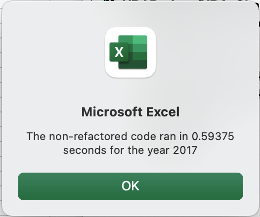

# Stocks Analysis with Excel VBA
Link to Excel document here: [VBA_Challenge](VBA_Challenge.xlsm)

## Overview of Project and Purpose
The project was to deepen applicable knowledge of refactoring VBA code in Excel, by looking at the runtime of the original, no-refactored code versus the refactored code. Both codes analyze the total volume and return of a full year of stock exchange data for 11 different stock tickers: AY, CSIQ, DQ, ENPH, FSLR, HASI, JKS, RUN, SEDG, SPWR, TERP, VSLR. 

This code specifically worked to hone skills in understanding indexing across arrays, nested for loops, if-then statements, as well as conditional formatting and style formatting. In addition to valuable coding skills such as refactoring code, debugging and evaluating overall code performance.

### Analysis Results
The results of the VBA code, show that 10 out of the 11 tickers had positive returns in the year 2017. With tickers DQ, ENPH, FSLR, and SEDG having an annual return of over 100%. 

Where as for the year 2018, show that only 2 tickers out of the 11 had positive returns. Specifically tickers ENPH and RUN, with more than 80% annual return. Where as the remaining 9 tickers had negative annual returns.

ENPH is the only stock ticker that had a positive return for both 2017 and 2018 years.

| 2017 | 2018 |
| ------------ | ------------- |
|  | |

### Non-refactored versus Refactored Performance
The run-time from the original, non-refactored code to the refactored code decreased by a little over 0.4 seconds for both datasets. Both codes were running on the same datasets for 2017 and 2018. This shows the power in how changing the structure of the code can have a large impact on the run-time performance. 

| Non-Refactored | Refactored |
| ------------ | ------------- |
| | |
|  | |

So what about the code itself made such a big difference in run-time?

The original, non-refactored code has a nested For loop in which each loop reads into each cell in the entire dataset. In addition, is a need to activate different sheets through the loops, which also reduces performance and increases run-time. Where as, with the refactored code, there is not a nested For loop, but the use of indeces and arrays, which means only one loop that iterates through all cell values in the dataset. The values needed are then stored into an array and then final array is intereated through to produce the final output. This takes less time, since arrays are more efficient.

Here are some great resources that provide ways to increase VBA code efficiencies:

[Excel VBA Speed and Efficiency](https://www.soa.org/news-and-publications/newsletters/compact/2012/january/com-2012-iss42/excel-vba-speed-and-efficiency/)

[9 Quick Tips to Improve VBA](https://techcommunity.microsoft.com/t5/excel/9-quick-tips-to-improve-your-vba-macro-performance/m-p/173687)

## Summary
Overall, it is clear from the analysis the benefits that came from refactoring this specific stock analysis code. The refactored code reduced the run time, which can have significant impact when the raw stock data is including hundreds, if not thousands, of tickers and their associated stock data.

### Advantages and Disadvantages of Refactoring Code
This project helped emphasize the importance of refactoring code -- in order to increase code performance and reduce run-time. 

#### Advantages 
The advantages of refactoring code includes, but is not limited to:
1. Increasing the overall performance of the code, reducing run-time.
2. Decreasing the amount of memory or processing power needed to run the code.
3. Helps in finding bugs in the code, since the main factor in refactoring is trying to reduce the level of complexity in the code -- such as nested loops.

#### Disadvantages
The disadvantages of refactoring code includes, but is not limited to:
1. Can take a lot more time, since the entire code might have to be rewritten in order to account for all inefficiencies.
2. Can create more issues, especially if the programmer refactoring does not fully understand what the entire code is doing and how to make it more efficent while still maintaining the same action the code is meant to carry out.
